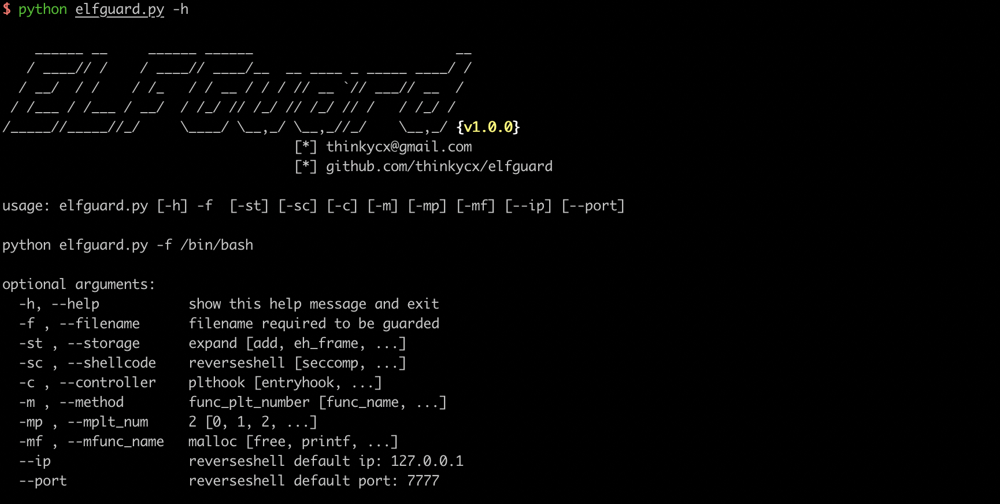

# ELFGuard
ELFGuard is a simple tool which helps you to guard your ELF binary.  
You could insert the shellcode into the ELF binary to do anything you want, such as 

1. use a SECCOMP shellcode to restrict syscalls
2. use a reverse shell shellcode to leave a backdoor
3. more in future... 

Only support amd64 arch now. Wish you enjoy it and don't be evil ;)

# Prerequisites
- python2  
- pwntools & [binutils](http://docs.pwntools.com/en/stable/install/binutils.html)

# Modules
## Storage Module
Find proper space to store the shellcode and return the file's offset to write shellcode.
- expand a segment
- add a segment
- .eh_frame

## Shellcode Module
Generate specified shellcode to use:
- SECCOMP
- reverse shell

## Controller Module
control the flow control: 
- entry point hjack
- PLT HOOK

# TODO
- [x] OOP
- [ ] i386 arch supported
- [ ] more shellcode